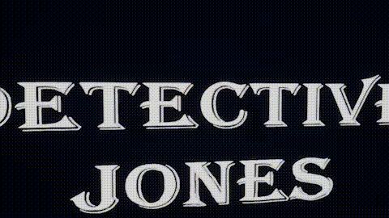

# Unreal Engine Technical Art Showcase
Modified the empty white room template for a horror aesthetic using ligthing stencils, blending, and distortion fields.

Lacks post processing effects such as vignette, dirt/grime overlay, and gamma correction.

    <h2>Watch Complete Showcase</h1>
    <table border="0">
        <tr>
            <td align="center"></td>
            <td align="center"></td>
        </tr>
        <tr>
            <td align="center"><a href="https://youtu.be/UV-zYD_o2Tg">Demo</a></td>
            <td align="center"><a href="https://youtu.be/1Fu5_XdPZ58">Behind the Scenes</a></td>
        </tr>
    </table>
    <h2>Previews</h1>
    <table>
        <tr>
            <td align="center"></td>
            <td align="center"></td>
        </tr>
        <tr>
            <td align="center"><b>DistanceField Distortion</b></td>
            <td align="center"><b>DistanceField Visibility and Distortion</b></td>
        </tr>
        <tr>
            <td align="center"></td>
            <td align="center"></td>
        </tr>
        <tr>
            <td align="center"><b>Animated Light Stencils</b></td>
            <td align="center"><b>Min Shader</b></td>
        </tr>
    </table>

